## Build a serverless distributed application in .NET using Saga orchestration pattern 

Saga design pattern can be used to preserve the data integrity with distributed transactions across microservices. The source code in this repo provides sample code for the implementation of the saga orchestration pattern using .NET 6.0 on AWS.  

Blog reference: [https://aws.amazon.com/blogs/compute/building-a-serverless-distributed-application-using-a-saga-orchestration-pattern/](https://aws.amazon.com/blogs/compute/building-a-serverless-distributed-application-using-a-saga-orchestration-pattern/)

## Security

See [CONTRIBUTING](CONTRIBUTING.md#security-issue-notifications) for more information.

## License

This library is licensed under the MIT-0 License. See the LICENSE file.

## Overview
This example uses a Step Functions workflow to implement the saga orchestration pattern, using the following architecture:

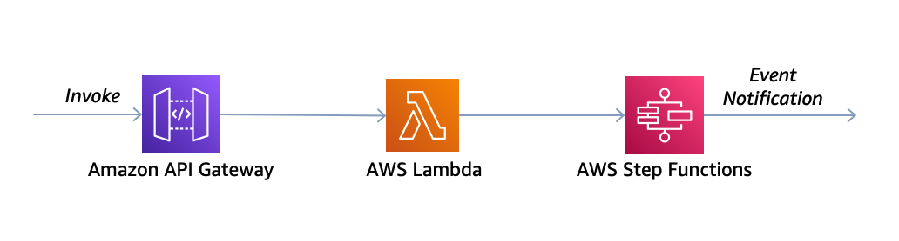

## The Step Functions workflow
The following diagram shows the steps that are run inside the Step Functions workflow. The green boxes show the steps that are run successfully. The order is placed, inventory is updated, and payment is processed before a Success state is returned to the caller.

The orange boxes indicate the compensatory transactions that are run when any one of the steps in the workflow fails. If the workflow fails at the Update inventory step, then the orchestrator calls the Revert inventory and Remove order steps before returning a Fail state to the caller. These compensatory transactions ensure that the data integrity is maintained. The inventory reverts to original levels and the order is reverted back.

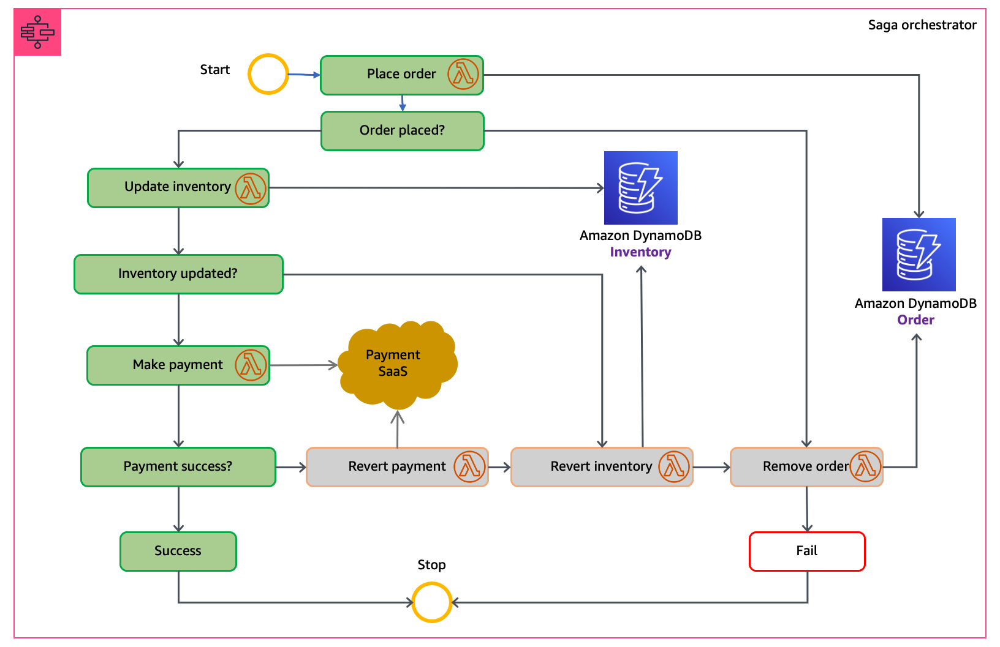

This preceding workflow is an example of a distributed transaction. The transaction data is stored across different databases and each service writes to its own database.

## Prerequisites

For this walkthrough, you need:
- An [AWS](https://signin.aws.amazon.com/signin?redirect_uri=https%3A%2F%2Fportal.aws.amazon.com%2Fbilling%2Fsignup%2Fresume&client_id=signup) account
- An AWS user with AdministratorAccess (see the [instructions](https://console.aws.amazon.com/iam/home#/roles%24new?step=review&commonUseCase=EC2%2BEC2&selectedUseCase=EC2&policies=arn:aws:iam::aws:policy%2FAdministratorAccess) on the [AWS Identity and Access Management](http://aws.amazon.com/iam) (IAM) console)
- Access to the following AWS services: Amazon API Gateway, AWS Lambda, AWS Step Functions, and Amazon DynamoDB.
- [Node.js](https://nodejs.org/en/download/) installed
- .NET 6.0 SDK installed
- To install the global tool provided by AWS for managing .NET Core Applications with Lambda
```bash
dotnet tool install -g Amazon.Lambda.Tools
```
- JetBrains Rider or Microsoft Visual Studio 2017 or later (or Visual Studio Code)
- [Postman](https://www.postman.com/downloads/) to make the API call

## Setting up the environment

For this walkthrough, use the AWS CDK code in the GitHub Repository to create the AWS resources. These include IAM roles, REST API using API Gateway, DynamoDB tables, the Step Functions workflow and Lambda functions.

1. You need an AWS access key ID and secret access key for configuring the AWS Command Line Interface (AWS CLI). To learn more about configuring the AWS CLI, follow these instructions.
2. Clone the repo:

```bash
git clone https://github.com/aws-samples/saga-orchestration-netcore-blog
```

3.  Navigate to cdk-saga-orchestration and create the folder lambdas

``` bash
cd cdk-saga-orchestration
```

``` bash
mkdir lambdas
```

4.  Now that we have created the lambdas folder, we will navigate to the saga-orchestration directory.  Once there we want to do a ls command to view the files inside the directory

```bash
ls
```

 We should see the following inside the saga-orchestration directory:

```bash
InvokeOrchestratorLambda
MakePaymentLambda		
README.md
RevertInventoryLambda		
SendNotificationLambda
LICENSE				
PlaceOrderLambda
RemoveOrderLambda		
RevertPaymentLambda
UpdateInventoryLambda
```

5.  All of the Lambda functions above must be packaged and copied from the saga-orchestration directory to the cdk-saga-orchestration/lambdas directory before deployment.

Run these commands to package the first function: In this case "PlaceOrderLambda"

```bash
cd PlaceOrderLambda/src/PlaceOrderLambda
```
```bash
dotnet lambda package
```

Once it is packaged you will see something like this: 

"Lambda project successfully packaged: 

/xxxx/saga-orchestration-netcore-blog/saga-orchestration/RevertPaymentLambda/src/RevertPaymentLambda/bin/Release/net6.0/RevertPaymentLambda.zip"

We will then copy this zip. to our cdk-saga-orchestration/lambdas directory:

For example

```bash
cp xxxx/watemc/saga-orchestration-netcore-blog/saga-orchestration/RevertPaymentLambda/src/RevertPaymentLambda/bin/Release/net6.0/RevertPaymentLambda.zip xxxx/saga-orchestration-netcore-blog/cdk-saga-orchestration/lambdas
```

6. Repeat the above for the remaining Lambda functions until all the functions have been packaged and copied to the cdk-saga-orchestration/lambdas directory

7. Build the CDK code before deploying to the console:
```bash
cd cdk-saga-orchestration/src/CdkSagaOrchestration
```

```bash
dotnet build
```

8. Install the aws-cdk package:
```bash
npm install -g aws-cdk 
```

9. The cdk synth command causes the resources defined in the application to be translated into an AWS CloudFormation template.  In essence, "cdk synth" is the step that translates the higher-level CDK code into a format (CloudFormation) that AWS can directly understand and act upon.

The cdk deploy command deploys the stacks into your AWS account.

Run:
```bash
cd cdk-saga-orchestration
```
```bash
cdk bootstrap
```
```bash
cdk synth
```
```bash
cdk deploy
```
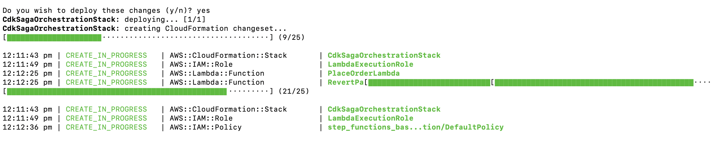

10. CDK deploys the environment to AWS. You can monitor the progress using the CloudFormation console. The stack name will be CdkSagaOrchestrationStack

E.g.

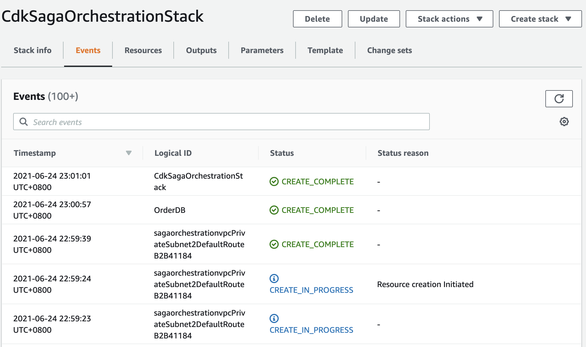

## The Step Functions configuration
The CDK creates the Step Functions workflow, DistributedTransactionOrchestrator. The following snippet defines the workflow with AWS CDK for .NET:

## C#
```
{
var stepDefinition = placeOrderTask
    .Next(new Choice(this, "Is order placed")
        .When(Condition.StringEquals("$.Status", "ORDER_PLACED"), updateInventoryTask
            .Next(new Choice(this, "Is inventory updated")
                .When(Condition.StringEquals("$.Status", "INVENTORY_UPDATED"),
                    makePaymentTask.Next(new Choice(this, "Is payment success")
                        .When(Condition.StringEquals("$.Status", "PAYMENT_COMPLETED"), successState)
                        .When(Condition.StringEquals("$.Status", "ERROR"), revertPaymentTask)))
                .When(Condition.StringEquals("$.Status", "ERROR"), waitState)))
        .When(Condition.StringEquals("$.Status", "ERROR"), failState));
}
```

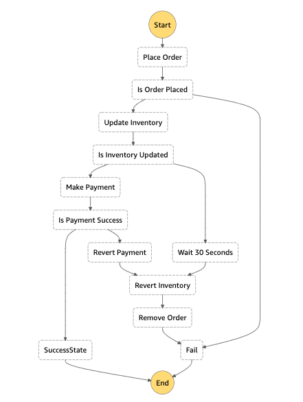

Compare the states language definition for the state machine with the definition above. Also observe the inputs and outputs for each step and how the conditions have been configured. The steps with type Task call a Lambda function for the processing. The steps with type Choice are decision-making steps that define the workflow.

## Setting up the DynamoDB table
The Orders and Inventory DynamoDB tables are created using AWS CDK. The following snippet creates a DynamoDB table with AWS CDK for .NET:

## C
```
{var inventoryTable = new Table(this, "Inventory", new TableProps
{
    TableName = "Inventory",
    PartitionKey = new Attribute
    {
        Name = "ItemId",
        Type = AttributeType.STRING
    },
    RemovalPolicy = RemovalPolicy.DESTROY
});}
```

1. Open the DynamoDB console and select the Inventory table.
2. Choose Create Item.
3. Select Text, paste the following contents, then choose Save.

## JSON

```
{
  "ItemId": "ITEM001",
  "ItemName": "Soap",
  "ItemsInStock": 1000,
  "ItemStatus": ""
}
```

Create two more items in the *Inventory* table:

```
{
  "ItemId": "ITEM002",
  "ItemName": "Shampoo",
  "ItemsInStock": 500,
  "ItemStatus": ""
}

{
  "ItemId": "ITEM003",
  "ItemName": "Toothpaste",
  "ItemsInStock": 2000,
  "ItemStatus": ""
}
```

The Lambda functions UpdateInventoryLambda and RevertInventoryLambda increment and decrement the ItemsInStock attribute value. The Lambda functions PlaceOrderLambda and UpdateOrderLambda insert and delete items in the Orders table. These are invoked by the saga orchestration workflow.

## Triggering the saga orchestration workflow
The API Gateway endpoint, SagaOrchestratorAPI, is created using AWS CDK. To invoke the endpoint:

1.  From the API Gateway service page, select the SagaOrchestratorAPI:

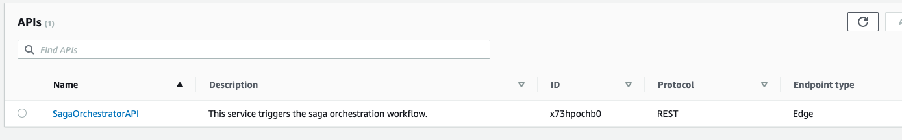

2.  Select *Stages* in the left menu panel:

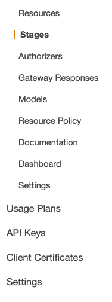

3. Select the prod stage and copy the Invoke URL:

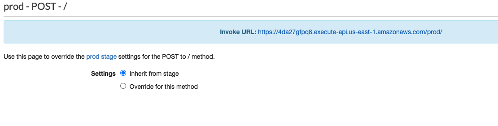

4.  From Postman, open a new tab. Select POST in the dropdown and enter the copied URL in the textbox. Move to the Headers tab and add a new header with the key ‘Content-Type’ and value as ‘application/json’:

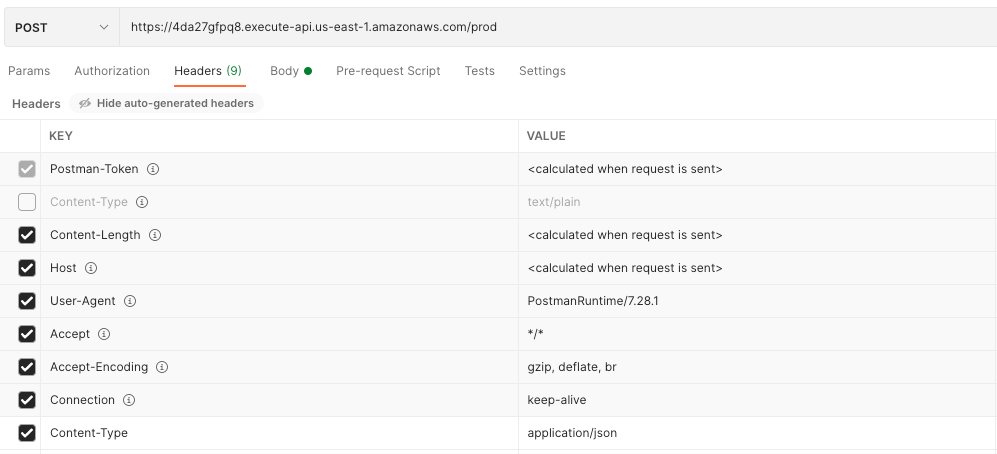

5. In the Body tab, enter the following input and choose Send.

## JSON

```
{
  "ItemId": "ITEM001",
  "CustomerId": "ABC/002",
  "MessageId": "",
  "FailAtStage": "None"
}
```

6. You will see this output:

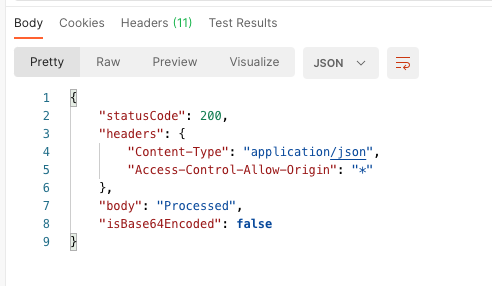

7.  Open the Step Functions console and view the execution. The graph inspector shows that the execution has completed successfully.

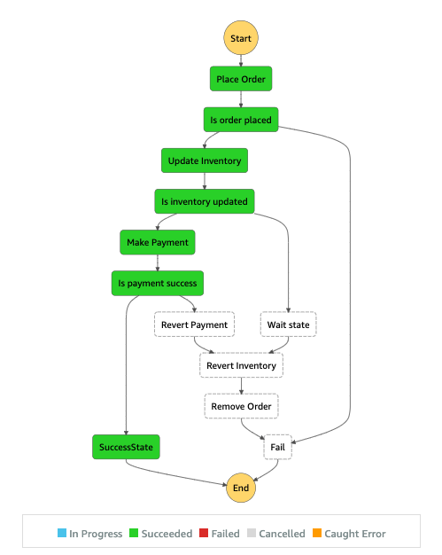

8.  Check the items in the DynamoDB tables, Orders & Inventory. You can see an item in the *Orders* table indicating that an order is placed. The ItemsInStock in the *Inventory* table has been deducted.

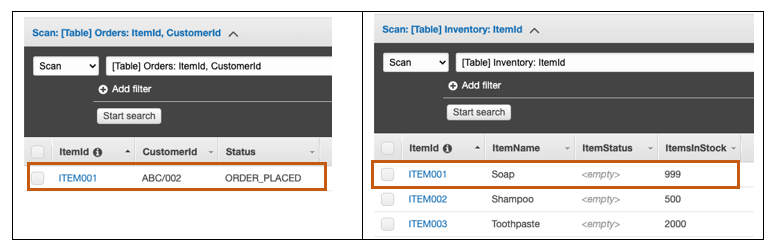

9.  To simulate the failure workflow in the saga orchestrator, send the following JSON as body in the Postman call. The FailAtStage parameter injects the failure in the workflow. Select Send in Postman after updating the Body:

## JSON

```
{
  "ItemId": "ITEM002",
  "CustomerId": "DEF/002",
  "MessageId": "",
  "FailAtStage": "UpdateInventory"
}
```

10.  Open the Step Functions console to see the execution.

11.  While the function waits in the wait state, look at the items in the DynamoDB tables. A new item is added to the Orders table and the stock for Shampoo is deducted in the Inventory table.

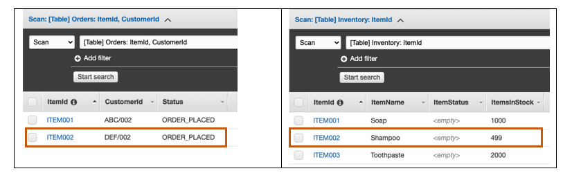

12. Once the wait completes, the compensatory transaction steps are run:

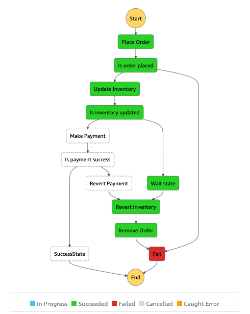

13. In the graph inspector, select the Update Inventory step. On the right pane, click on the Step output tab. The status is ERROR, which changes the control flow to run the compensatory transactions.

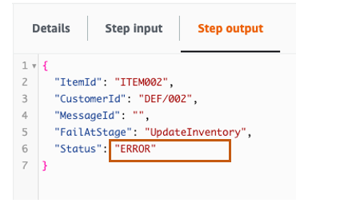

14.  Look at the items in the DynamoDB table again. The data is now back to a consistent state, as the compensatory transactions have run to preserve data integrity:

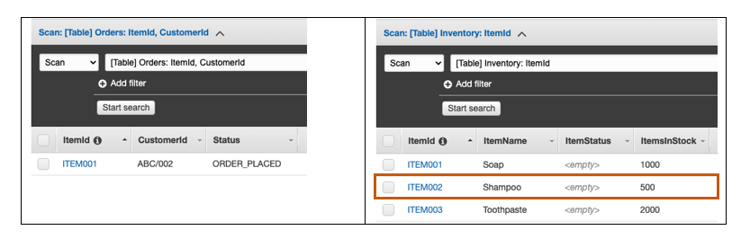

The Step Functions workflow implements the saga orchestration pattern. It performs the coordination across distributed services and runs the transactions. It also performs compensatory transactions to preserve the data integrity.

## Cleaning up
To avoid incurring additional charges, clean up all the resources that have been created. Run the following command from a terminal window. This deletes all the resources that were created as part of this example.

```bash
cdk destroy
```

## Conclusion
This post showed how to implement the saga orchestration pattern using API Gateway, Step Functions, Lambda, DynamoDB, and .NET Core 3.1. This can help maintain data integrity in distributed transactions across multiple services. Step Functions makes it easier to implement the orchestration in the saga pattern.


